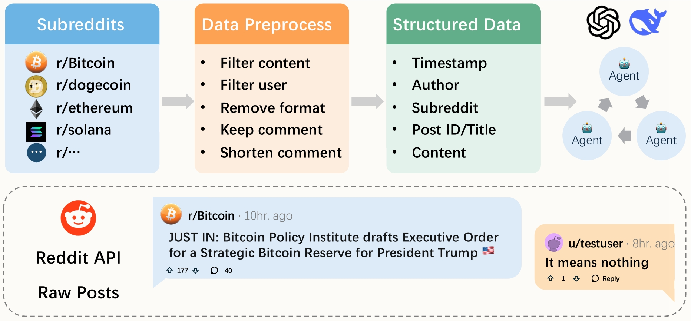

# RedditDataset

Here is a novel dataset designed for benchmarking Multi-Agent System (MAS) approaches in high-frequency cryptocurrency trading. It aligns granular price data (from Binance) and off-chain Reddit discussion signals, enabling research on how real-time social sentiment influences algorithmic trading decisions under realistic market conditions.

## Overview




This dataset provides synchronized on-chain (price/volume/technical indicator) and off-chain (Reddit post) data for four major coins: BTC, ETH, DOGE, and SOL. Researchers can use this dataset to evaluate the effectiveness of sentiment-aware trading agents across various market regimes and time granularities.

## Table of Contents

- [Dataset Overview](#dataset-overview)
- [Dataset Schema](#dataset-schema)
- [Getting Started](#getting-started)
  - [Installation](#installation)
  - [Requirements](#requirements)
  - [Dataset Loading](#dataset-loading)
- [License](#license)
- [Acknowledgement](#acknowledgement)

## Dataset Overview

> **Note on Data Version**: The current release (v1.0) contains timestamp, title, and content data. A future version (v2.0) will include Reddit comments to provide more comprehensive social sentiment analysis.

This dataset contains the following components for each supported coin:

- `prices`: OHLCV data (open, high, low, close, volume) at multiple granularities (5m, 15m, 1h, 4h), sourced from Binance.
- `reddit`: Cleaned and normalized Reddit content (with metadata and sentiment scores).

## Dataset Schema

The dataset is organized in the following structure:

### Reddit Posts (JSONL Format)
Each Reddit post is stored in JSONL format (one JSON object per line) with the following structure:
```json
{
    "created_utc": <timestamp>,
    "title": <post_title>,
    "selftext": <post_content>,
    "comments": [
        {
            "created_utc": <timestamp>,
            "body": <comment_text>
        },
        ...
    ]
}
```

### Price Data
| File | Key Columns / Fields | Description |
|------|---------------------|-------------|
| price | timestamp, open, high, low, close, volume | OHLCV data at multiple timeframes |

## Getting Started

### Installation

1. Download the repository and extract the dataset files to your project directory.
2. (Optional) Set up a Python environment to run the example scripts.

### Requirements

The following Python packages are required for loading and analyzing this dataset (see requirements.txt):

- pandas
- numpy
- scikit-learn
- requests

### Dataset Loading

Example for loading the dataset:

```python
import pandas as pd
df = pd.read_csv('reddit_processed.csv')
print(df.head())
```

## License

This dataset is released under the CC BY-NC-SA license.

## Acknowledgement

Market data provided by [Binance](https://data.binance.vision/?prefix=data/spot/monthly/klines/); Reddit data collected via the [Reddit Data API](https://www.reddit.com/dev/api).

